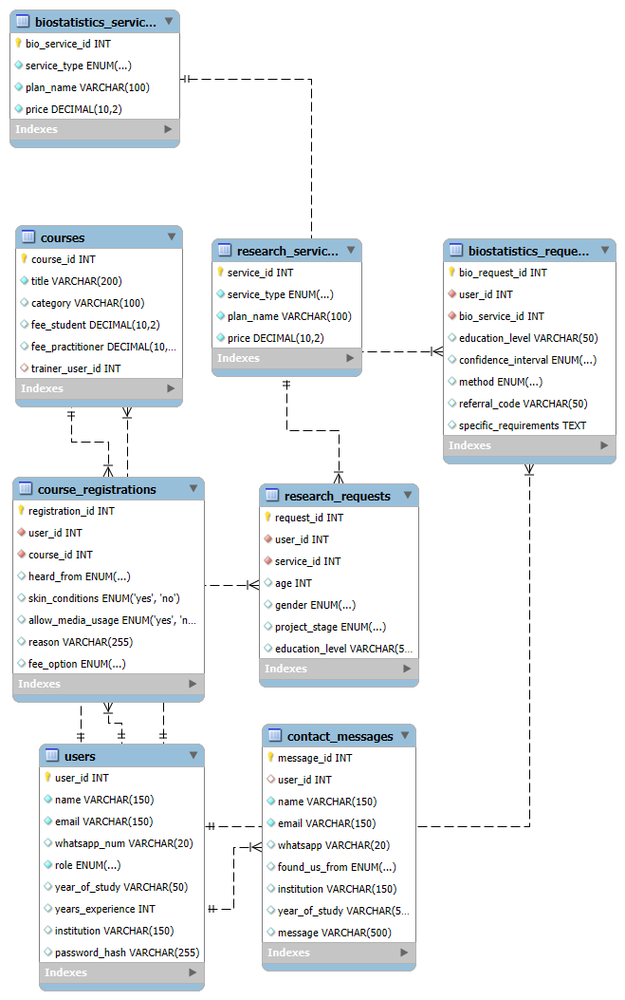

# PhysioSimplified SQL Project

**Author:** Tirupati Vitoshini

---

## Project Description
This project is a SQL database implementation for **PhysioSimplified**, a platform that educates students and professionals in physiotherapy through online and offline courses, workshops, and research/biostatistics support. The database captures users, courses, registrations, contact messages, research requests, and biostatistics requests.

---

## Features
- **User Management:** Handles students, practitioners, trainers, and admin users with roles and relevant details.
- **Course Management:** Tracks courses, trainers, and student/practitioner enrollments.
- **Course Registrations:** Maintains course registrations with options like “heard from,” “allow media usage,” and fee selections.
- **Contact Messages:** Captures messages and inquiries from users.
- **Research Services & Requests:** Manages thesis writing and mentorship requests.
- **Biostatistics Services & Requests:** Supports sample size calculations and statistical analysis requests.
- **Indexes:** Optimized database access for user and course lookups.

---

## File Structure
- schema.sql → Contains all CREATE TABLE statements
- data.sql → Contains all INSERT statements
- queries.sql → Sample SELECT queries
- ER_diagram.png → Database schema diagram
- README.md → This file

## Database Setup
1. Open **MySQL Workbench** (or your preferred MySQL client).
2. Create a new database:
   ```sql
   CREATE DATABASE physiosimplified;
   USE physiosimplified;


# ER Diagram

